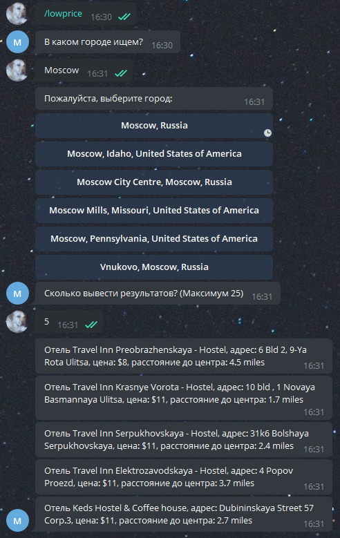

# Telegram bot для анализа сайта Hotels.com и поиска подходящих пользователю отелей
##Используемые библиотеки
```
loguru==0.5.3
  - colorama [required: >=0.3.4, installed: 0.4.4]
  - win32-setctime [required: >=1.0.0, installed: 1.0.3]
pyTelegramBotAPI==3.8.1
  - requests [required: Any, installed: 2.26.0]
    - certifi [required: >=2017.4.17, installed: 2021.5.30]
    - charset-normalizer [required: ~=2.0.0, installed: 2.0.3]
    - idna [required: >=2.5,<4, installed: 3.2]
    - urllib3 [required: >=1.21.1,<1.27, installed: 1.26.6]
python-decouple==3.4
python-statemachine==0.8.0

```

###Запуск бота
Для подключения бота необходимо создать файл .env в корне скрипта и прописать в нем токен Вашего бота, а также key-api.

Пример содержимого файле .env:

``TOKEN=1646100356:AAHRAalkQd3K7Ufwfmu3DH9B9c0iWIlZLPI``

``rapdapi-key=gd5fg48dgd1g56d6g6df654df8gdf6g``

Запуск скрипта происходит командой ```python main.py``` из теримнала

###Описание компонентов

Бот создан для предоставления информации о доступных отелях в интересующем городе пользователя.

-  По команде /help выводится сообщение о доступных командах;
-  По команде /lowprice выводится список отелей в интересующем городе пользователя, которые отсортированы в порядке увеличения цены;
-  По команде /highprice выводится список отелей в интересующем городе пользователя, которые отсортированы в порядке уменьшения цены;
-  По команде /stop останавливается текущее действие.

###Пример работы бота




